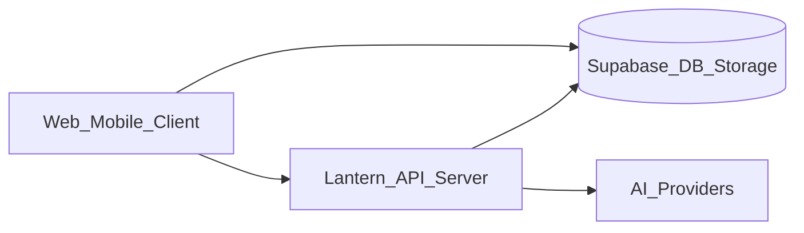

# Subprocessor Register

**Last updated:** June 13, 2026

| Subprocessor | Purpose | Data types | Region | DPA |
|--------------|---------|------------|--------|-----|
| Supabase | Database, auth, storage, realtime | All app data | Configurable (often US/EU) | Supabase DPA |
| Groq | AI inference (Llama) | Prompt content | US | Review required |
| Google (Gemini) | AI inference | Prompt content | US/Global | Google Cloud DPA |
| Cloudflare Workers AI | AI inference fallback | Prompt content | Global | Cloudflare DPA |
| Hugging Face | AI inference fallback | Prompt content | US/EU | HF terms |
| Google OAuth | Sign-in | Email, profile | Global | Google OAuth terms |
| Apple Sign In | Sign-in | Email, profile (optional name on first sign-in) | Global | Apple terms |
| Sentry (optional) | Error monitoring | Stack traces, IP | US/EU | Sentry DPA |
| Expo | Push delivery (mobile) | Push tokens | US | Expo terms |

## Data flow (summary)

User content sent to AI providers only when the user invokes an AI feature.
